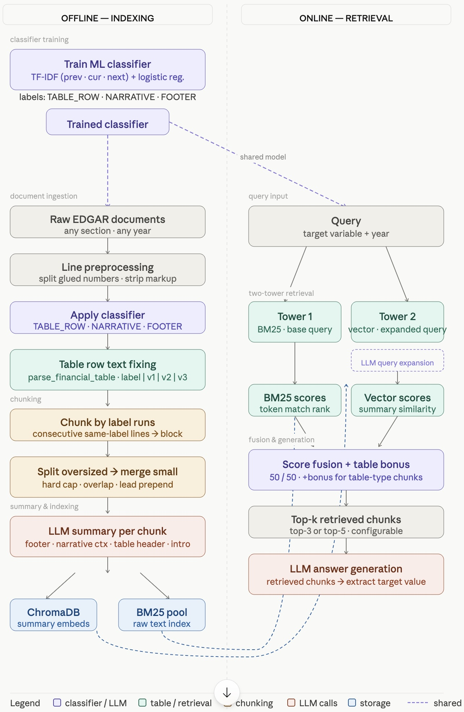

# AIG 10-K RAG Workflow

This repository builds a retrieval pipeline for AIG 10-K filings, with:
- model-based line classification (`table_row` vs `narrative`, footer handled separately),
- chunking for indexing,
- Chroma indexing,
- hybrid retrieval (BM25 on chunk text + embedding on summary/context),
- LLM-based extraction and evaluation.

## 1) Pipeline


## 2) Setup

Run from repo root:

```bash
cd /Users/jshin/Workspace/aig-rag
python3 -m venv .venv
.venv/bin/pip install -r requirements.txt
```

Required environment variable:

- `OPENROUTER_API_KEY`
- `EDGAR_IDENTITY_EMAIL` (email used by SEC EDGAR identity)

Optional:

- `OPENROUTER_MODEL` (default: `openai/gpt-4o-mini`)

Create `.env` in repo root:

```bash
OPENROUTER_API_KEY=your_openrouter_api_key
EDGAR_IDENTITY_EMAIL=you@example.com
OPENROUTER_MODEL=openai/gpt-4o-mini
```

ChromaDB setup:
- Chroma is installed from `requirements.txt` during setup.
- Start Chroma server (Default DB path is `./db`):

```bash
source .venv/bin/activate
chroma run --path ./data
```

- Then initialize/update indexed data:

```bash
source .venv/bin/activate
python index_chunks_to_chroma.py --max-filings 6
```

## 3) Run Pipeline

Start Chroma server once per session:

```bash
source .venv/bin/activate
chroma run --path ./db
```

### Step A. Optional: review generated chunks before indexing

Generate chunk preview for a single filing item:

```bash
source .venv/bin/activate
python review_session_data.py \
  --max-filings 3 \
  --filing-index 1 \
  --max-chunk-chars 4000 \
  --chunk-overlap-chars 800 \
  --out data/review_session_data.json
```

### Step B. Build and index chunks to Chroma

```bash
source .venv/bin/activate
python index_chunks_to_chroma.py --max-filings 6 --max-chunk-chars 4000 --chunk-overlap-chars 800
```

### Step C. Run app

```bash
source .venv/bin/activate
streamlit run app.py
```

The app loads existing `db` automatically.
If DB files exist but collection has no chunks, run Step B first.

### Step D. Evaluate retrieval + extraction

```bash
source .venv/bin/activate
python rag_search.py
```

Useful options:
```bash
python rag_search.py --refresh-rewrite
python rag_search.py --workers 4
```

## 4) Chunking Logic (summary)

a. Table detection: Chunking first cleans and classifies lines as `table_row`, `narrative`, or `footer` (by a simple classifier and REGEX), and groups consecutive same-type lines into chunks. 

b. Table row normalization: Table rows are normalized with `parse_financial_table()` to align labels and numeric columns and to handle parenthesized negatives. 

c. Split large chunk: Chunks larger than `max_chunk_chars` (default 4000) are split by character budget while respecting line boundaries, and narrative lead-ins before the first table row are peeled into a separate chunk. 

d. Merge small chunks: Very small chunks below `SMALL_CHUNK_MAX_CHARS` (500) are merged into the previous chunk to avoid tiny fragments. A trailing overlap window (`chunk_overlap_chars`, default 800) is inserted at the start of the next chunk as a synthetic leading line so context and labels are preserved. 

e. Summary for each chunk: Summaries and derived metadata are recomputed once after splitting, merging, and overlap are finalized; final chunks include metadata but omit internal helper fields.


## 5) Retrieval Logic

Retrieval is implemented in `src/retrieval/retrieve_docs.py` by `TableAwareRetriever`. 

a. It filters chunks for the target year then ranks candidates using BM25 on chunk `text` and embedding similarity on `hybrid_embedding_text`. 

b. BM25 is computed with `rank_bm25` over tokenized chunk text; embedding similarity is measured by similarity between expanded query (LLM) and chunk summary. 

c. Scores are normalized and fused using the `BM25_SCORE_WEIGHT` and `EMBEDDING_SCORE_WEIGHT` environment-configurable weights; Boost weights for BM25 if target chunk nature is table. 

d. the retriever returns the requested `top_k`.

## 6) Training / Pseudo Labels

Train table detector model:

```bash
source .venv/bin/activate
python src/indexing/train/train_table_detector.py
```

Model artifact:
- `model/table_row_classifier.joblib`

Runtime behavior:
- The app/retrieval code loads this saved model from `model/table_row_classifier.joblib`.
- Model loading is cached in-process, so it is loaded once and reused until process restart.

Generate pseudo labels for CSV line data: (Need human review for editing)

```bash
source .venv/bin/activate
python -m src.indexing.train.pseudo_label_table_rows --input-dir data
```
## 7) Experimental Results

Ground Truth:

| year | total_revenues | sp_rating | shareholders_equity |
|---|---|---|---|
| 2021 | "586,481" | BBB+ | "66,362" |
| 2022 | "596,112" | BBB+ | "65,956" |
| 2023 | "526,634" | BBB+ | "40,002" |
| 2024 | "539,306" | BBB+ | "45,351" |
| 2025 | "161,322" | BBB+ | "42,521" |


The table below summarizes evaluation result for `different chunking/retrieval methods` on the target task.

| Method | Chunking | Chunk size | Chunk overlap | Top K | Accuracy | Recall@3 | MRR |
|---|---|---|---|---|---|---|---|
| Hybrid + Table Bonus + M/L + Table Row Cleaning | Table | 2000 | 400 | 3 | 100% (15/15) |  100% (15/15) | 0.8556 |
| Hybrid + Table Bonus + M/L + Table Row Cleaning | Table |2000 | 400 | 1 | 80% (12/15) |  80% (12/15) | - |
| Hybrid + M/L + Table Row Cleaning | Table | 2000 | 400 | 3 | 66.67% (10/15) |  53.33% (8/15) | 0.4222 |
| Embedding + M/L + Table Row Cleaning | Table | 2000 | 400 | 3 | 13.33% (2/15) | 13.33% (2/15) | 0.0889 |
| BM25 + M/L + Table Row Cleaning | Table | 2000 | 400 | 1 | 40% (6/15) | 40.00% (6/15) | - |
| BM25 + M/L + Table Row Cleaning | Table | 2000 | 400 | 3 | 93.33% (14/15) | 93.33% (14/15) | 0.7222 |
| BM25 + M/L + No Table Row Cleaning | Table | 2000 | 400 | 3 | 26.67% (4/15) | 26.67% (4/15) | 0.2667 |
| BM25 + Regex + Table Row Cleaning | Table | 2000 | 400 | 3 | 66.67% (10/15) | 66.67% (10/15) | 0.6667 |
| BM25 + Regex + No Table Row Cleaning | Table | 2000 | 400 | 3 | 66.67% (10/15) | 66.67% (10/15) | 0.6667 |
| BM25 | Simple | 2000 | 400 | 3 | 66.67% (10/15) | 66.67% (10/15) | 0.5111 |


The table below summarize evaluation result for `different chunking configurations` on the target task.

| Method | Chunking | Chunk size | Chunk overlap | Top K | Accuracy | Recall@3 | MRR |
|---|---|---|---|---|---|---|---|
| Hybrid + Table Bonus + M/L + Table Row Cleaning | Table | 1000 | 200 | 5 | 100% (15/15) |  100% (15/15) | 0.6444 |
| BM25 + M/L + Table Row Cleaning | Table | 1000 | 200 | 5 | 80.00% (12/15) | 80.00% (12/15) | 0.4967 |
| Hybrid + Table Bonus + M/L + Table Row Cleaning | Table | 1000 | 200 | 3 | 93.33% |  93.33% (14/15) | 0.6222 |
| BM25 + M/L + Table Row Cleaning | Table | 1000 | 200 | 3 | 53.33% (8/15) | 53.33% (8/15) | 0.4333 |


The table below summarize chunking stats with `different table detection/chunking mechanism` and chunk size.

| Method | Max chunk size | Chunk overlap | Total Chunk | Table Chunk | Narrative Chunk | Chunk Size Distribution |
|---|---|---|---|---|---|---|
| M/L | 2000 | 400 | 5133 | 2509 | 2642 | "p10": 783.0, "p25": 1282.5, "p75": 2222.0, "p90": 2370.0|
| Rule | 2000 | 400 | 5383 | 3067 | 2316 | "p10": 659.0, "p25": 1157.0, "p75": 2182.5, "p90": 2390.0 |
| Simple | 1000 | 200 | 9886 | 0 | 9886 | "p10": 1000.0, "p25": 1000.0, "p75": 1000.0, "p90": 1000.0 |


### Challenging Case Example: `underwriting_income`

**Variable:** `underwriting_income`  
**Label:** "Underwriting Income - General Insurance Segment"

**Why is this challenging?**

- The term appears in many places throughout the filing.
- Figures are reported for different contexts: consolidated, operating segments, and by location (e.g., international vs. North America).
- The relevant title or section for the operating segment may not be close to the actual value in the document, making context association difficult.

| Method | Chunking | Chunk size | Chunk overlap | Top K | Accuracy | Recall@3 | MRR |
|---|---|---|---|---|---|---|---|
| Hybrid + Table Bonus + M/L + Table Row Cleaning | Table | 1000 | 200 | 5 | 40.00% (2/5) | 40.00% (2/5) | 0.2000 |
| BM25 + M/L + Table Row Cleaning | Table | 1000 | 200 | 5 | 0% (0/5) |  20% (1/5) | 0.0667 |